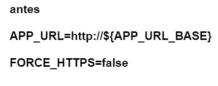
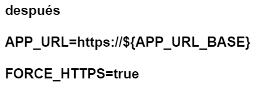

#Instalación del Facturador

##Docker | Linux | SSL externo 

###### facturaloperu.com 

###### 2019 

## Paso
- Para instalar debe ejecutar el script evitando instalar el SSL, le será consultado en el proceso y deberá ingresar "n"

- Finalizada la instalación debe dirigirse a la ruta de instalación
cd /root/facturadorpro31/

- debe editar el archivo .env

nano .env

dentro del editor ubicar los parámetros y cambiarlos

- una vez finalizado, guarde y salga del editor

- ejecute los siguientes comandos para eliminar la caché de la aplicación

php artisan config:Cache

- con eso habrá completado el lado de la herramienta, en ese momento hasta no tener un SSL configurado no podrá 

acceder a la herramienta

## Importante

recuerde habilitar el puerto 443 para poder tener acceso a la herramienta

