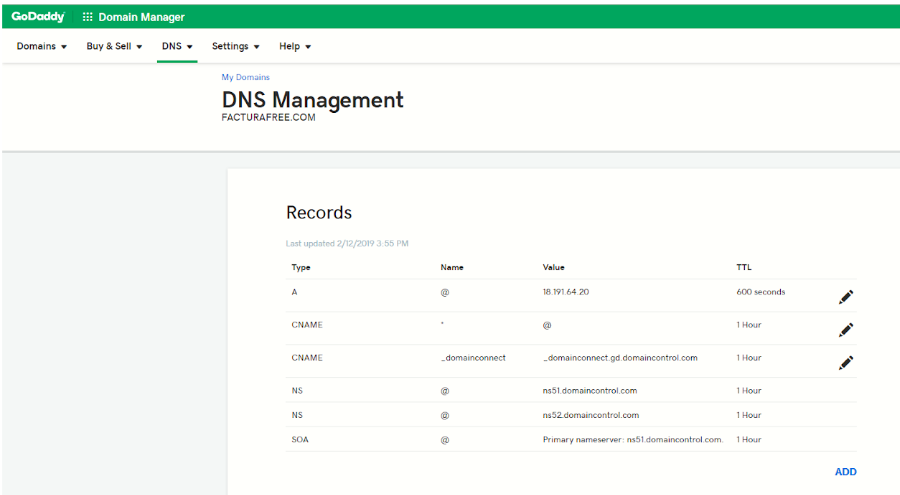
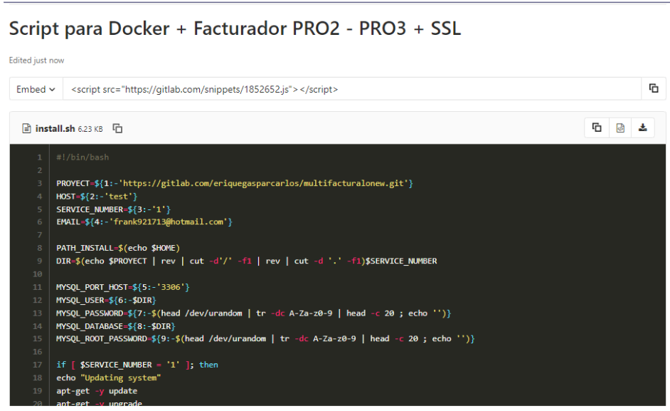
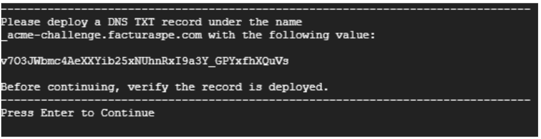
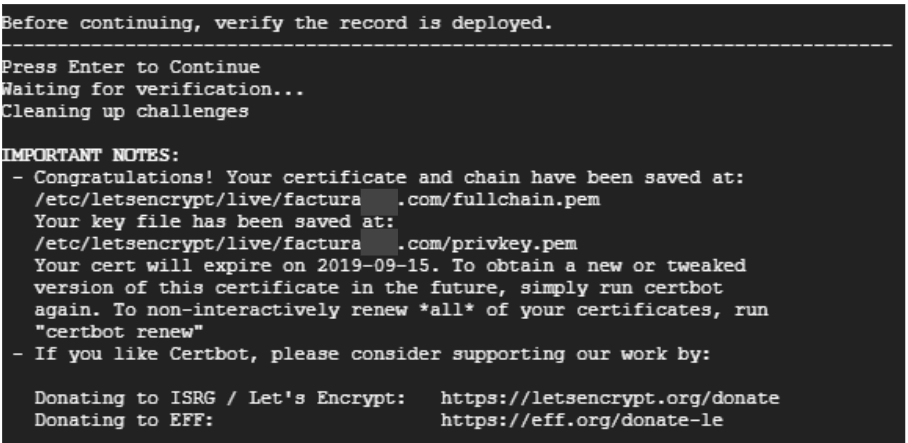

### Manual para Script de Instalación

#### Docker + GitLab + SSL

###### PRO 1 | PRO 2

###### facturaloperu.com 

###### 2019 

## Descripción

Hemos elaborado un script para uso en instancias Linux, este es un archivo .sh que actualiza el sistema, instala las herramientas, sus dependencias, configura un certificado SSL renovable cada 90 días que debe ser confirmado en el proceso con su dominio y realiza todas las configuraciones previas, dejando el aplicativo listo para probar en menos de 20 minutos , su ejecución es muy sencilla.

## Requisitos previos

1. Tener acceso a su servidor, vps, máquina virtual o local via SSH, en las instalaciones que realizamos para AWS o Google Cloud, hacemos entrega del usuario, la IP del servidor y la clave ssh que puede ser un archivo .ppk o .pem.

2. Tener instalado una versión de ssh en su máquina para conectarse de manera remota, puede utilizar putty, filezilla o una consola terminal.

3. Es importante configurar su dominio apuntando a la IP de su instancia para que durante la ejecución del script se valide el certificado SSL y al finalizar la ejecución no tenga errores y todo esté listo para realizar pruebas. Edite los récords A y CNAME donde A debe contener su IP y CNAME el valor * (asterisco) para que se tomen los subdominios registrados por la herramienta.

4. Durante la ejecución del script deberá almacenar en su dominio dos registros TXT con unos valores que se mostrarán en pantalla, estos registros son validados en directo y no pueden tardar más de 2 minutos en validarse en su dominio.

5. En caso de contar con servicios instalados en su instancia como mysql, apache o nginx, debe detenerlos, ya que estos ocupan los puertos que pasarán a usarse con el aplicativo y los contenedores de Docker.

## Pasos

1. Acceder a su instancia vía SSH.

2. Loguearse como super usuario 
ejecute **sudo su**

3. Ubicarse en la carpeta del usuario, por ejemplo 
cd /home/ubuntu/

4. Crear el archivo install
ejecute **touch install.sh**

5. Editar el archivo con su editor preferido
ejecute **nano install.sh**

6. En el archivo debe agregar el contenido del siguiente enlace:

   <a>https://gitlab.com/snippets/1852652</a>

   Observará a una página como la siguiente, donde debe copiar el contenido del script y pegarlo en su archivo install.sh, es importante que mantenga las estructura del mismo.

   

7. Para salir de editor y guardar puede presionar **“ctrl + x”** seguidamente se le consultará si desea guardar los cambios, confirme con **“y”** y luego **“enter”.**

8. Debe darle permisos de ejecución al archivo:
ejecute **chmod +x install.sh**

9. El comando a utilizar requiere de dos parámetros principalmente:

   ./install.sh [repositorio] [dominio]

   por ejemplo:

   ./install.sh <a>https://gitlab.com/rash07/facturadorpro2</a> elfacturador.com

10. Una vez ejecutado el comando se iniciará un proceso donde debe ir aceptando las preguntas y que le mostrará en pantalla los       
    valores que debe añadir en los 2 récords tipo TXT de su dominio con nombre 

    a. _acme-challenge.example.com 

    b. _acme-challenge (casos como godday y puntope)

    en la siguiente imagen le muestran el valor como v703JW.... debera copiarlo y añadirlo al primer record TXT, seguidamente pulsar enter, se le mostrará en pantalla un segundo valor para el segundo TXT

    

11. Editados los récords en su dominio, deberá aceptar para continuar y que el proceso verifique que sea exitoso, de ser exitoso obtendrá una pantalla similar a la siguiente

12. Continuará el proceso de actualización del sistema, se le solicitará el usuario y contraseña de GitLab, para que se pueda clonar/descargar el proyecto en su instancia, luego culminará y tendrá los accesos listos en su dominio:

    Correo: admin@gmail.com

    Contraseña: 123456

    Una vez finalizado, puede proseguir con el manual de pruebas o demás documentación de cada proyecto, sus URL son:

    PRO1:

    <a>https://gitlab.com/rash07/facturadorpro1</a>

    PRO2:

    <a>https://gitlab.com/rash07/facturadorpro2</a>

## Recomendaciones

    
 - Luego de instalar el facturador puede cambiar algunos parámetros en el archivo .env como:

        - La dirección de envío de correos que utiliza el facturador para enviar los archivos pdf, xml y cdr a sus clientes

        - Cambiar algunas configuraciones de plantillas de los pdf

        - entre otros.

- Recuerde que siempre que se edita el archivo .env debe utilizar el comando “php artisan config:cache” dentro del contenedor de fpm1, para más detalles puede observar el manual de actualización aqui 

- La ruta donde ejecute el script será donde se clone el repositorio, debe verificar que los usuarios del servidor tengan permisos a dicha ruta si desea acceder desde ftp o scp.

